# ISLANDORA ISLE Installation on CentOS 7 using Kickstart

[ISLE Site](https://islandora-collaboration-group.github.io/ISLE/)

[ISLE Code](https://github.com/Islandora-Collaboration-Group/ISLE)

From the [ISLE](https://islandora-collaboration-group.github.io/ISLE/) site: 

ISLE separates an institution’s customizations from core code, and moves that core code into containers that are easily updated, simplifying and largely automating the process of installation and updates/maintenance of Islandora. ISLE also bundles together the best shared modules into a common, production-ready and security-hardened platform.

[ICG Site](https://islandora-collaboration-group.github.io/)

[ICG Code](https://github.com/Islandora-Collaboration-Group) 

# Why CentOS? 

"Why do I want this installed on CentOS if the developer shows installing on Ubuntu?" 

This is a common issue within the world of Open Source Software. Many developers make the choice to use Ubuntu to develop their applications. It's a choice based on that Ubuntu has a good desktop environment to develop applications with. 

However, in Academics and Academic research programs, many Systems/IT Environments are heavily invested in Red Hat Enterprise Based Operating systems. So Ubuntu is something that isn't as common in the Data Center and skill-sets of IT. As a System's person myself, I do what I can to facilitate this gap between developer's and systems people. This helps everyone as when a researcher comes to IT for help,  it makes it more difficult for IT to try to manage an Operating System they aren't as familiar with.

So, using my expertise with Red Hat based systems and kickstart I have built this procedure so to be able to give back to the open source project. This contribution will allow other researchers who would like to utilize this project to be able to install and run it on a RedHat based platform. By utilizing a platform that IT is more familiar with, they will be able to get help from their local IT staff at their organization. 

It also helps minimize the steps needed to get this up and running since this automatic procedure (kickstart) will compile and build the software as part of the Operating System installation. This may reduce the need for assistance from IT to assist faculty with their own attempts to build one of these platforms. 


# Requirements 

To make this process as simple as possible to build the Linux host, all you need to do is download the CentOS 7 minimal ISO installer. 

You can download it from one of these [mirrors](http://isoredirect.centos.org/centos/7/isos/x86_64/)

## Create CDROM

### Virtual CD

If you are using a virtual platform like Virtual Box or VMWare you don't really need to "Burn" the CDROM ISO. You can mount that directly to the virtual machine as a CDROM to boot from it. 

### Traditional CD-ROM Drive

Burn the ISO to a CD so you can boot from it. This is a useful document for [burning ISO's](https://www.centos.org/docs/5/html/CD_burning_howto.html).

On a PC, you can right click the ISO file and choose "Burn image to disk".

## Booting into a CD/DVD

Most PC BIOS's will allow you to temporarily boot from another medium (USB, CD, etc) by pressing an F key (ie. F12 or possibly another F key) when the system boots up. This will provide you with a menu of choices to boot from. Select the CDROM/DVD device. 


# Installation

The machine will get built according to this [ISLE kickstart file](https://raw.githubusercontent.com/hamhpc/ISLE-ks/master/ks_ISLE.cfg)

In order to get the installer to use this configuration we need to supply additional arguments to the bootloader. 

## 1.) Boot the host from the CDROM

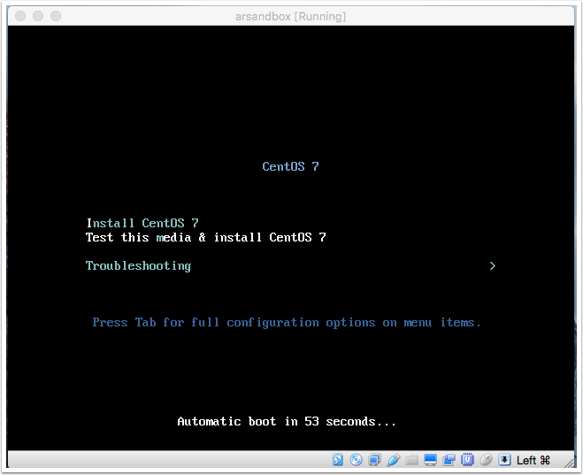

## 2.) Press TAB at installation menu

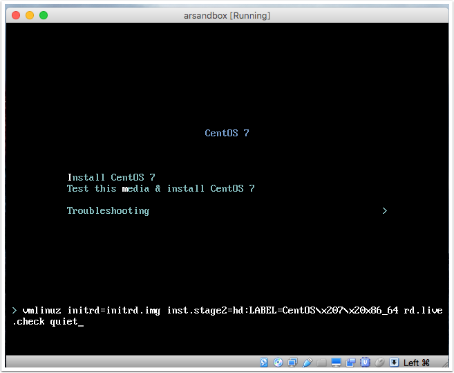

## 3.) Enter ks bootloader argument
after the word "quiet" add the following: 

```
ks=https://raw.githubusercontent.com/hamhpc/ISLE-ks/master/ks_ISLE.cfg
```

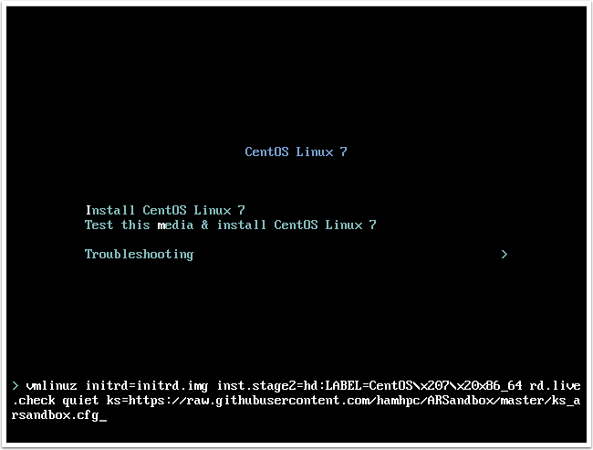

Press Enter to continue. 

## 4.) Select Installation Destination
This step may be optional depending on how your disks are discovered. If it detects a previously installed OS you'll need to tell the software to over-write this old installation. 

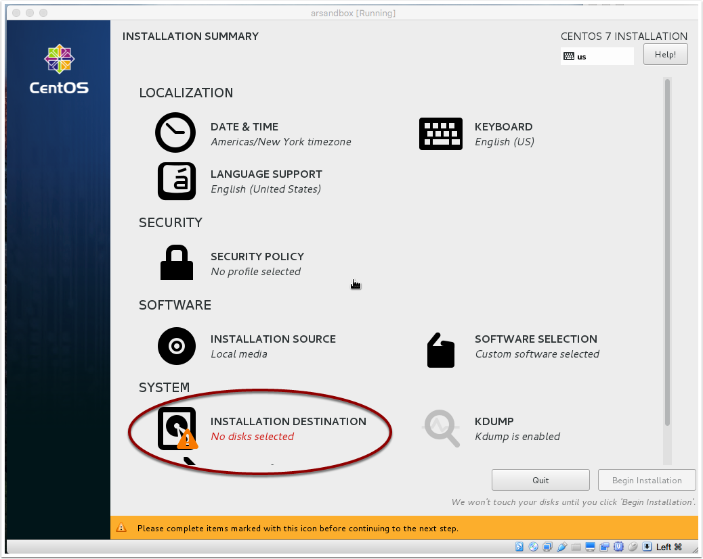

### 4a.) Configure for Automatic partition configuration

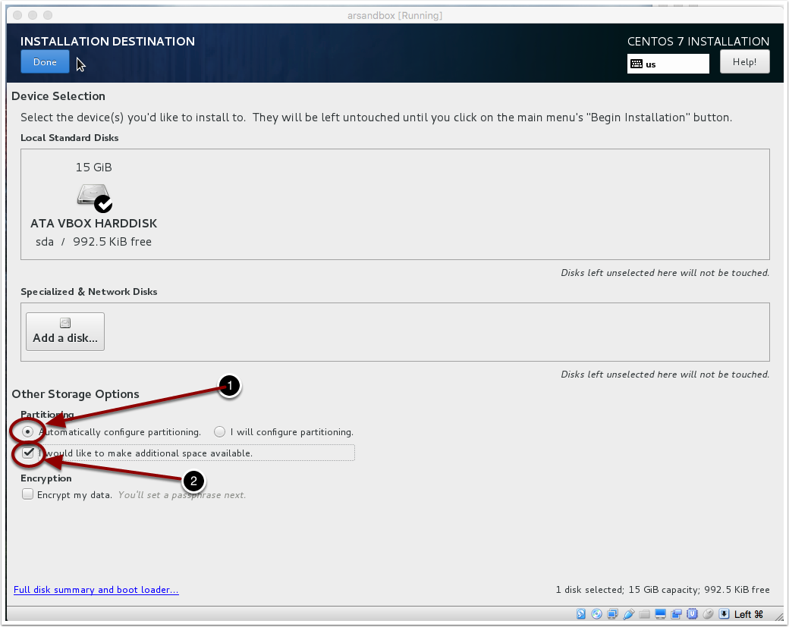

### 4b.) Delete All


### 4c.) Reclaim Space

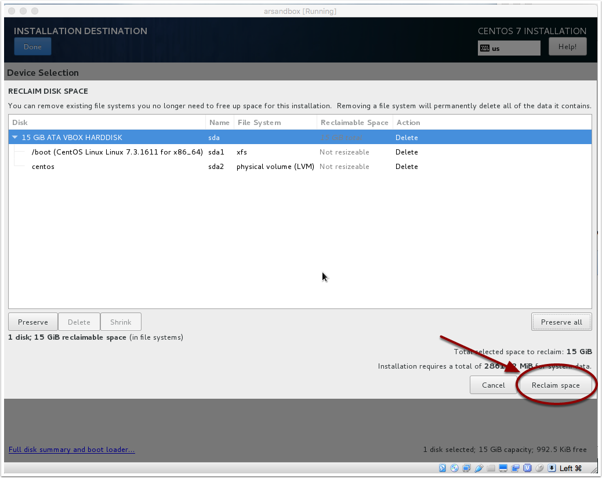

## 5.) Begin installation

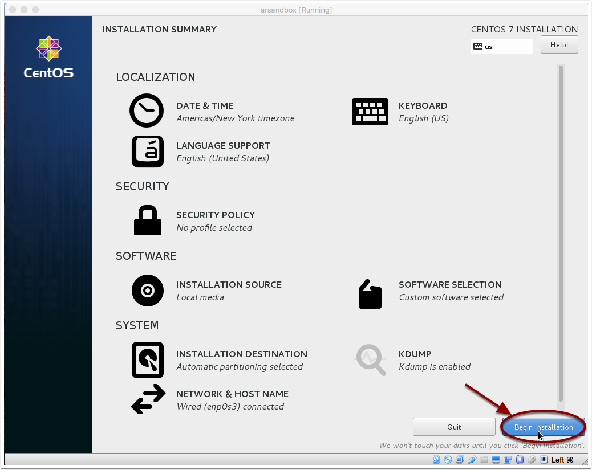

## 6.) Select Root Password

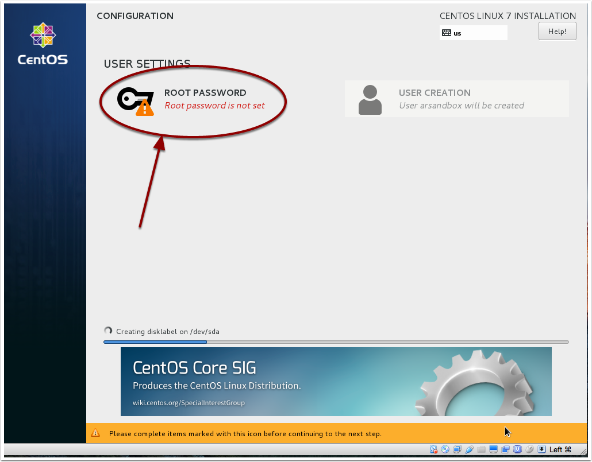

## 7.) Enter Root Password

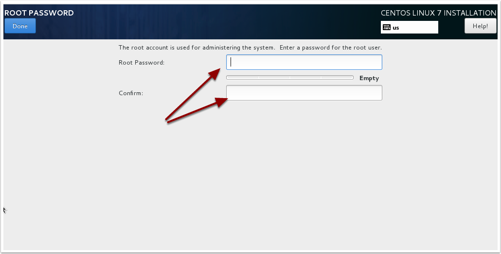

## 8.) Take a Break
 While the machine is building itself .. take a break as this could take a few minute to complete. Once it's up we'll be ready configure the rest of the ISLE software.

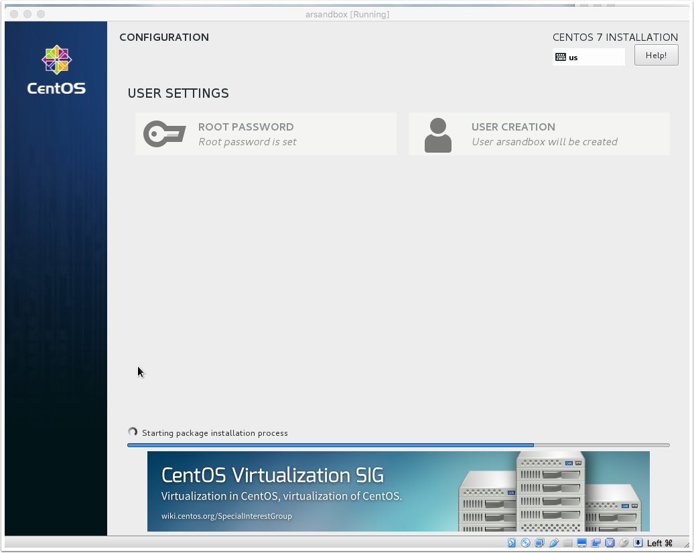

## 9.) Reboot when complete
Make sure you remove the CDROM before rebooting the machine. 

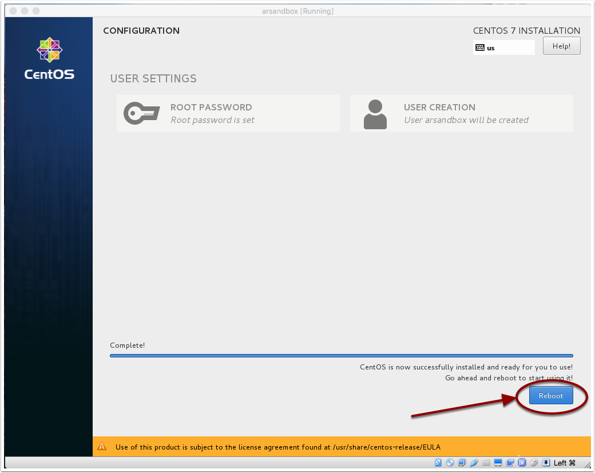

# Login to the Host

```
# ssh islandora@<your host>
```

# Install docker containers

```
# cd /opt/ISLE
# docker-compose up -d
```

# tweak the setup and install a site

```
# docker exec -it isle-apache-ld bash
#  cd /tmp/isle_drupal_build_tools
#  ./apache_provision.sh
```

# (Optional) Install portainer 
software to manage Docker containers (https://portainer.io)
login at http://<your_host>:9000

```
# docker volume create portainer_data
# docker run -d -p 9000:9000 -v /var/run/docker.sock:/var/run/docker.sock -v portainer_data:/data portainer/portainer
```

## 1.) Select Konsole
 Right click the desktop and choose Konsole

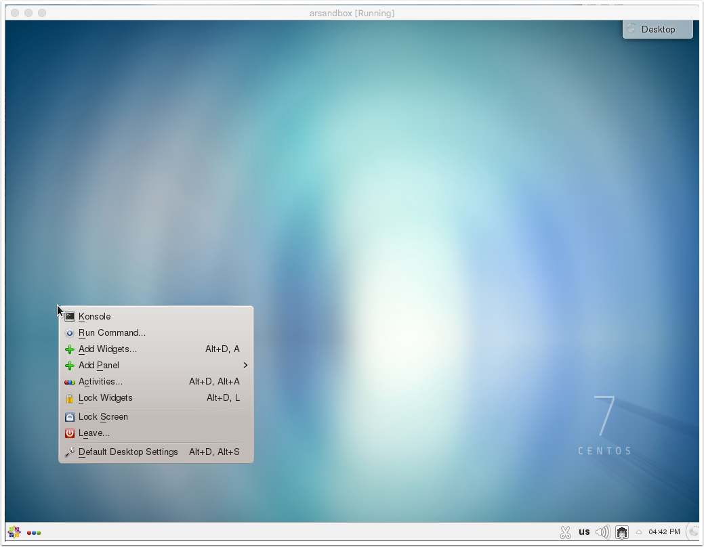

## 2.) Start typing commands

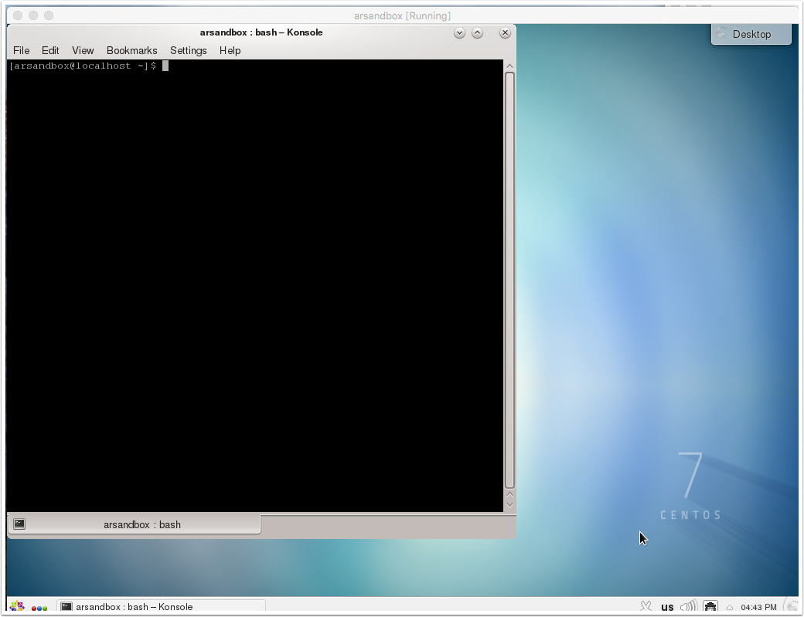


# Software Information

  * ISLANDORA is located at [http://islandora.ca](https://islandora.ca)
  * ISLE is located at [https://islandora-collaboration-group.github.io/ISLE/](https://islandora-collaboration-group.github.io/ISLE/)

# Installation Notes

  * The islandora user password is "isle2017"
  * ISLE is installed in /opt/ISLE
  * The user islandora owns the files in /opt so that account has full control over these installations to make changed as needed.
  * SELinux and Firewall is disabled so remember this isn't a secure as it could be if you leave it plugged into the network.
  * The user islandora is also a sudoer.. meaning if you need root access you can become root using the following command:

```
  % sudo su -
```

# Troubleshooting

 * [ISLE Issues (Bug Reporting)](https://github.com/Islandora-Collaboration-Group/ISLE/issues)
 * [ISLE Forum](https://groups.google.com/forum/#!forum/isle-updates)
 * [ISLANDORA Forum](https://groups.google.com/forum/?utm_source=digest&utm_medium=email#!forum/islandora/topics)
